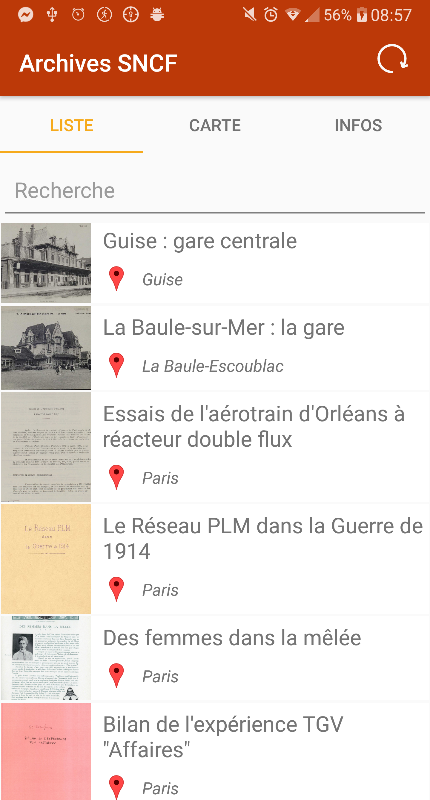
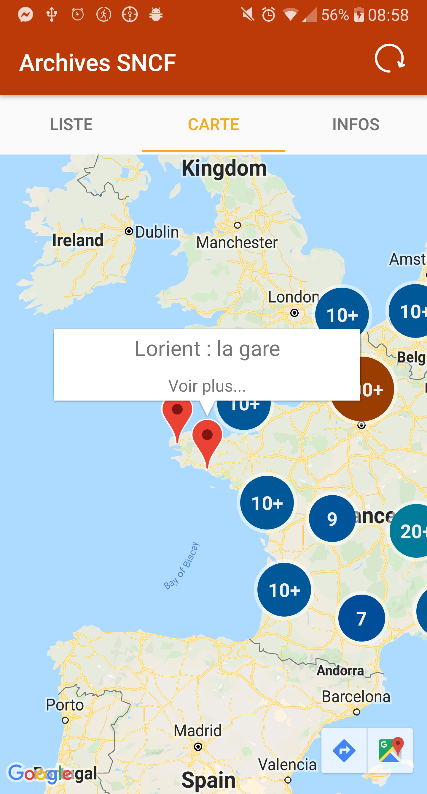
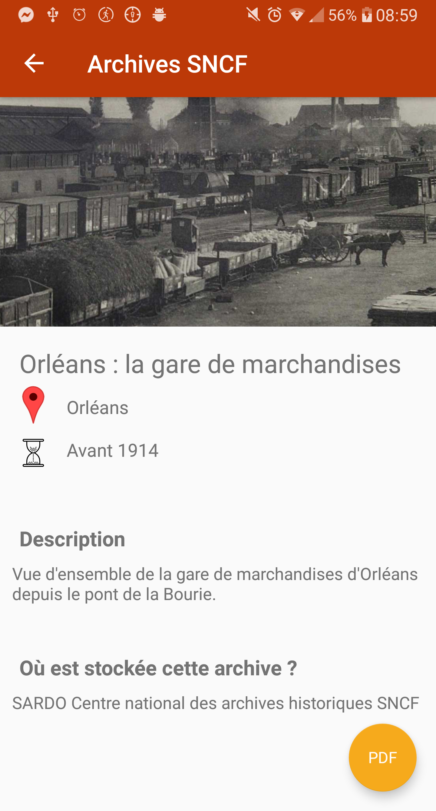

## Archives SNCF
  
Cette application a été codée par :   
 - Pierre SEITE,   
 - Hugo SERIEYS.    
 
Elle a été réalisée dans le cadre du cours Design of Mobile Application à l'Ecole des Mines de Saint-Etienne cursus ISMIN.

## Description  
 

  
  
  
   
  <i>Aperçu de l'application</i>

Cette application permet de consulter facilement des données d'archives de la SNCF. Grâce à la partie `liste`, l'utilisateur peut parcourir les différentes archives existantes et faire une recherche personnalisée en fonction de ce qu'il veut.   
Si l'utilisateur souhaite consulter des archives d'une certaine région, il peut utiliser la partie `carte` où toutes les archives sont affichées sur une carte en fonction de leur localisation.   
Chacune de ses archives, lorsqu'on clique dessus, s'affiche avec plus de détails et la possibilité de la télécharger directement cliquant sur l'image ou sur l'icone en bas à droite indiquant le format de l'archive.

Lien vers l'URL des données utilisées : [Lien](https://data.opendatasoft.com/explore/dataset/archives-sncf-new%40datasncf/information/?sort=-id&dataChart=eyJxdWVyaWVzIjpbeyJjb25maWciOnsiZGF0YXNldCI6ImFyY2hpdmVzLXNuY2YtbmV3QGRhdGFzbmNmIiwib3B0aW9ucyI6eyJzb3J0IjoiLWlkIn19LCJjaGFydHMiOlt7ImFsaWduTW9udGgiOnRydWUsInR5cGUiOiJsaW5lIiwiZnVuYyI6IkFWRyIsInlBeGlzIjoiaWQiLCJzY2llbnRpZmljRGlzcGxheSI6dHJ1ZSwiY29sb3IiOiIjMTQyRTdCIn1dLCJ4QXhpcyI6ImRhdGVfZGVfbnVtZXJpc2F0aW9uIiwibWF4cG9pbnRzIjoiIiwidGltZXNjYWxlIjoieWVhciIsInNvcnQiOiIifV0sImRpc3BsYXlMZWdlbmQiOnRydWUsImFsaWduTW9udGgiOnRydWV9&fbclid=IwAR1BPU3k_74faJKKRMM9JXwwFe_beRJjB9wH9kdl-tfiLWmVbMIMipMpzj0&location=7,47.69867,0.36804&basemap=jawg.sunny).
  
## Librairies externes et outils utilisés
- Langage de développement : Kotlin v1.3.50,
- Gestion des requêtes API : Retrofit 2.6.2,
- Gestion de la base de données locale : Room 2.2.1,
- Gestion de téléchargement d\'image : Glide 4.9.0,
- Affichage de la carte : Play Services Maps 17.0.0,
- Gestion de clustering sur la carte : Android maps utils 0.6.2.

## Consignes  
  
Lien vers le sujet : https://docs.google.com/presentation/d/1mwu2xx7_qfCZDfsRxseC94n7oBGYfhw-9xIftaTDbzk/edit#slide=id.p97  
  
### But du projet  
  
 - Le but du projet est de réaliser une application permettant de visualiser une série de données OpenData  
 - Les données devront être récupérées sur un serveur distant et affichées dans une liste et sur une carte  
 - Un clique sur un élément de la liste ou sur un marker de la carte permet d’accéder à un écran présentant le détail de l’élément  
 - Un écran présentera des informations générales sur les données récupérées  
  
### Exigences    
- [x] Format des données OpenData :   
	 - Format Json  
	 - Avec un champ correspondant à l’url d’une image  
	 - Avec un champ correspondant à une position  
 - [x] Application composée au minimum de 3 Fragment et 2 Activity  
 - [x] Une Actionbar sera présente et permettra de rafraîchir les données récupérées et affichées
 
 ## Bonus
 
 - Amélioration de l’expérience utilisateur :
    - [x] Clustering des markers sur la carte en fonction du niveau de zoom
    - [x] Mise en place d’un système de recherche/filtre sur la liste affichée
 
 - Enrichissements techniques :
    - [x] Mise en place d’une base de données locale pour afficher la liste d’élément en mode hors connexion
    - [ ] Utilisation de LiveData ou d’Observable pour la récupération de données dans la BDD
 
